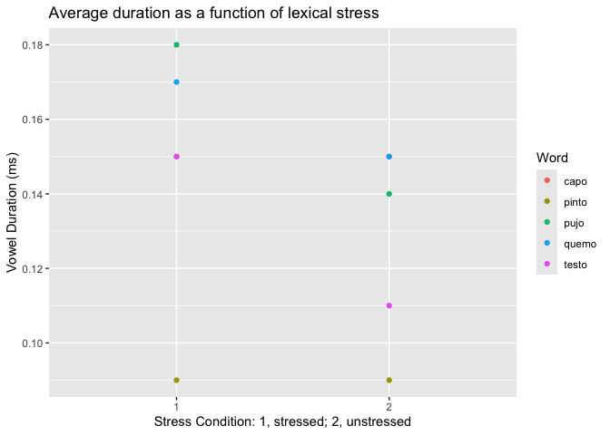
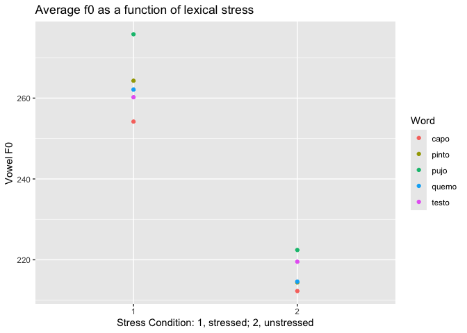
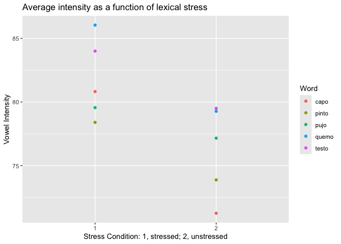

Load the necessary packages and read in the data.csv file into R (use an
R chunk)

``` r
# loading common packages, not sure if they'll be used
library(tidyverse)
```

    ## ── Attaching core tidyverse packages ──────────────────────── tidyverse 2.0.0 ──
    ## ✔ dplyr     1.1.4     ✔ readr     2.1.5
    ## ✔ forcats   1.0.1     ✔ stringr   1.5.1
    ## ✔ ggplot2   4.0.0     ✔ tibble    3.3.0
    ## ✔ lubridate 1.9.4     ✔ tidyr     1.3.1
    ## ✔ purrr     1.1.0     
    ## ── Conflicts ────────────────────────────────────────── tidyverse_conflicts() ──
    ## ✖ dplyr::filter() masks stats::filter()
    ## ✖ dplyr::lag()    masks stats::lag()
    ## ℹ Use the conflicted package (<http://conflicted.r-lib.org/>) to force all conflicts to become errors

``` r
library(ggplot2)

# see if R can read the file
read.csv("data/data.csv")
```

    ##       info durationV     f0   int
    ## 1   capo_1      0.15 254.19 80.82
    ## 2   capo_2      0.15 212.27 71.26
    ## 3  pinto_1      0.09 264.30 78.40
    ## 4  pinto_2      0.09 214.41 73.88
    ## 5   pujo_1      0.18 275.79 79.56
    ## 6   pujo_2      0.14 222.42 77.16
    ## 7  quemo_1      0.17 262.11 86.04
    ## 8  quemo_2      0.15 214.60 79.27
    ## 9  testo_1      0.15 260.22 84.00
    ## 10 testo_2      0.11 219.52 79.50

``` r
# asign data to an object
data <- read.csv("data/data.csv")

# view data
view(data)
```

Manipulate the data frame as necessary so that you can calculate average
duration, f0 and intensity as a function of lexical stress (extra points
if you can create a plot)

``` r
# data tidy

# one variable per cell
# separate word & stressed condition (1, stressed; 2, unstressed)
# change durationV column name

data_tidy <- data |>
  separate(
    col = info,
    into = c("word", "stress_cond"),
    sep = "_") |>
  rename(duration = durationV)

# data is ready!
```

Calculate average duration as a function of lexical stress

``` r
data_duration <- data_tidy |> 
  select(word, stress_cond, duration)

aggregate(duration ~ stress_cond, FUN = mean, data = data_duration)
```

    ##   stress_cond duration
    ## 1           1    0.148
    ## 2           2    0.128

Calculate average f0 as a function of lexical stress

``` r
data_f0 <- data_tidy |> 
  select(word, stress_cond, f0)

aggregate(f0 ~ stress_cond, FUN = mean, data = data_f0)
```

    ##   stress_cond      f0
    ## 1           1 263.322
    ## 2           2 216.644

Calculate average intensity as a function of lexical stress

``` r
# create data frame exclusive for dur
data_int <- data_tidy |> 
  select(word, stress_cond, int)

aggregate(int ~ stress_cond, FUN = mean, data = data_int)
```

    ##   stress_cond    int
    ## 1           1 81.764
    ## 2           2 76.214

Extra points if you can create a plot

``` r
# create plot for average duration as a function of lexical stress

ggplot(
  data = data_duration,
  mapping = aes(x = stress_cond, y = duration, color = word)
) +
  geom_point(aes(color = word)) +
  labs(
    title = "Average duration as a function of lexical stress",
    x = "Stress Condition: 1, stressed; 2, unstressed", y = "Vowel Duration (ms)",
    color = "Word")
```

<!-- -->

``` r
# create plot for average f0 as a function of lexical stress

ggplot(
  data = data_f0,
  mapping = aes(x = stress_cond, y = f0, color = word)
) +
  geom_point(aes(color = word)) +
  labs(
    title = "Average f0 as a function of lexical stress",
    x = "Stress Condition: 1, stressed; 2, unstressed", y = "Vowel F0",
    color = "Word")
```

<!-- -->

``` r
# create plot for average intensity as a function of lexical stress

ggplot(
  data = data_int,
  mapping = aes(x = stress_cond, y = int, color = word)
) +
  geom_point(aes(color = word)) +
  labs(
    title = "Average intensity as a function of lexical stress",
    x = "Stress Condition: 1, stressed; 2, unstressed", y = "Vowel Intensity",
    color = "Word")
```

<!-- -->
